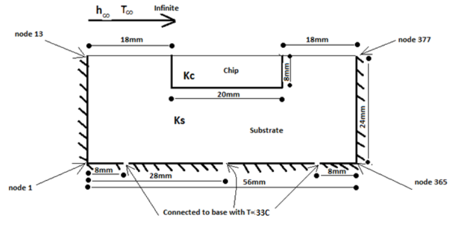
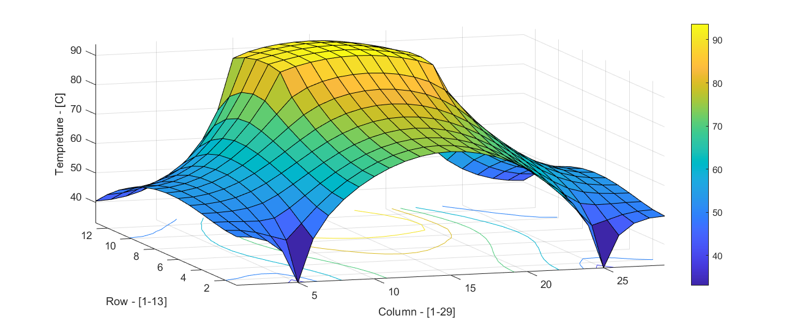
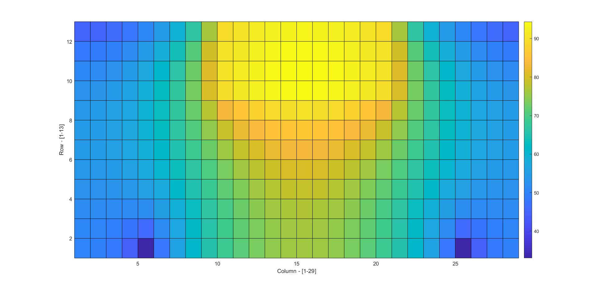

# HeatTransferSimulation

A simulation of a chip that is connected to a base. The chip is producing heat and from 3 sides is insulated, but from the one side a wind is blowing.

The problem is shown in the picture below:   The initial values are considered accordingly and can be seen in the code.

The code creates 365 nodes that are numbered according to the problem description. The simulation runs and solves the Steady State and then based on that answer calculates the best time step for unsteady solution of the problem. The end result of the simuation is something like this:  

